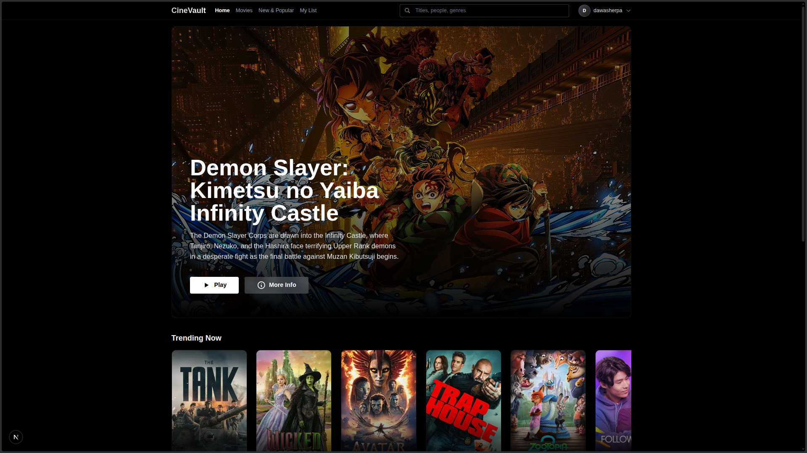

# CineVault - A Movie Discovery Platform

CineVault is a premium movie discovery platform built for the AI Full Stack Class. It features a modern, responsive design with advanced functionality including infinite scrolling, secure user profiles, and personalized recommendations.

## Presentation and Screenshots

 
---

## Key Features

- **Dynamic Hero Section**: A vibrant, high-impact landing with movie details and quick-action controls.
- **Infinite Scroll Discovery**: Seamless exploration of Movies, TV Shows, and Trending content without layout shifts.
- **Secure Authentication**: Complete auth system with JWT tokens and real-time validation.
- **Advanced Profile Settings**: 
  - Update username and email.
  - Secure password management requiring current password verification.
  - State-of-the-art security with bcrypt re-hashing.
- **Personalized Lists**: Manage your Watchlist and Favorites with optimistic UI updates.
- **Premium UI/UX**: Built with a sleek dark-mode aesthetic, utilizing glassmorphism and smooth micro-animations.

---

## Tech Stack

### Frontend
- **Framework**: Next.js 16 (React 19)
- **Styling**: Tailwind CSS 4
- **State Management**: React Context API
- **Icons**: Lucide React
- **Notifications**: Custom Toast System

### Backend
- **Runtime**: Node.js
- **Framework**: Express.js
- **Database**: MongoDB Atlas (Mongoose)
- **Security**: JWT (Authentication), BcryptJS (Encryption)

---

## Technical Highlights

- **Server-Side Hydration**: Initial data is fetched on the server for instant page loads and improved SEO.
- **Optimistic UI**: Real-time feedback for likes and watchlist additions using debounced API calls.
- **Global Auth & Toast Systems**: Centralized state management for a cohesive user experience across all routes.
- **Responsive Layouts**: Fully optimized for mobile, tablet, and desktop viewing.

---

## Local Development

### 1. Clone the repository
```bash
git clone https://github.com/your-username/movie-streaming-app.git
cd movie-streaming-app
```

### 2. Setup Server
```bash
cd server
npm install
npm run dev
```

### 3. Setup Client
```bash
cd ../client
npm install
npm run dev
```

---

## Deployment

This project is ready for multi-platform deployment:
- **Frontend**: Recommended for Vercel.
- **Backend**: Recommended for Render or Railway.

---

*Submitted for the AI Full Stack Class Assignment.*
